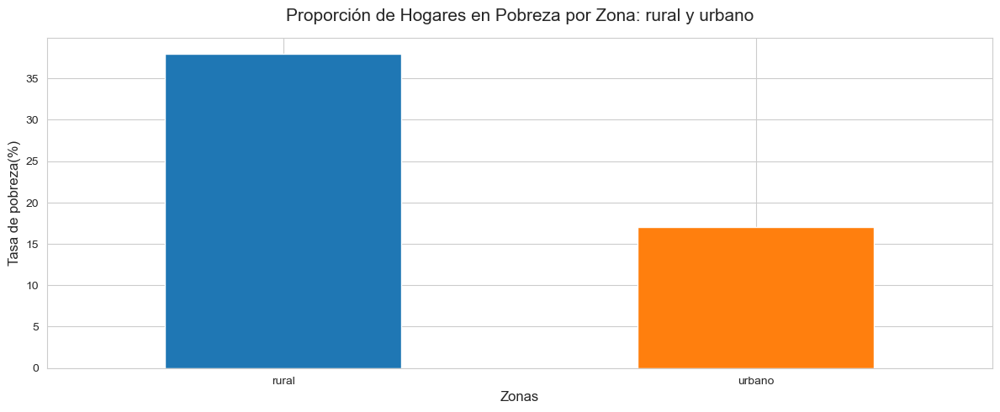

# Análisis de la pobreza en el Perú en 2022: ingresos e informalidad
## 1. Introducción
El proyecto “Análisis de la pobreza en el Perú por el nivel de ingresos e informalidad” evalúa la pobreza en los hogares peruanos durante 2022 utilizando datos de la ENAHO del INEI. A través del análisis de más de 87,000 registros con Python, se identifican disparidades de ingresos, patrones de informalidad laboral y diferencias clave entre áreas urbanas y rurales. Este proyecto incluye limpieza de datos, creación de variables como "estado de pobreza", y visualizaciones que destacan la relación entre ingresos, informalidad y pobreza, ofreciendo insights para orientar políticas públicas.
* [Datos: Módulo 2022-500 de la ENAHO.](https://www.datosabiertos.gob.pe/dataset/encuesta-nacional-de-hogares-enaho-2022-instituto-nacional-de-estad%C3%ADstica-e-inform%C3%A1tica-%E2%80%93)
* Link del proyecto: [PobrezaPerú2022](https://github.com/WLozanoH/PovertyAnalysisPeru2022/blob/main/ProyectoPobrezaPeru.ipynb)

### 2. Resultados destacados:
* El 38% de los hogares rurales son pobres, comparado con el 17% en zonas urbanas.
* La desigualdad económica es moderada-alta, con un Índice de Gini de 0.45.
* Un mayor ingreso y la formalidad laboral reducen significativamente la probabilidad de pobreza.
  


El gráfico de la tasa de pobreza en función de los ingresos promedio e informalidad muestra cómo la pobreza está fuertemente vinculada a los niveles de ingreso. También resalta que los trabajos formales tienden a proporcionar ingresos más altos, lo que destaca la importancia de políticas que promuevan la formalización laboral

## 3. Objetivo del Proyecto

Entender la relación entre los ingresos, la informalidad laboral y la pobreza en el Perú, destacando disparidades regionales y proponiendo políticas públicas para su mitigación.

## 4. Hipótesis

* Hipótesis Nula (H0): El ingreso total no afecta la probabilidad de que un hogar sea clasificado como pobre.
* Hipótesis Alternativa (H1): Un mayor ingreso total reduce la probabilidad de que un hogar sea clasificado como pobre.

## Datos utilizados

### 5. Datos utilizados

* Origen: Encuesta Nacional de Hogares (ENAHO) del INEI de Perú.
* Módulo de Interés: Módulo de ingresos y empleo (Enaho01a-2022-500).
* Archivo disponible: [Módulo 2022-500](https://github.com/WLozanoH/PovertyAnalysisPeru2022/blob/main/Enaho01a-2022-500.zip).

## 6. Metodología

### Limpieza de datos
1. 🧹 **Estandarización**:
   - Renombrado de columnas para facilitar su interpretación.
   - Creación de diccionarios para mapear variables categóricas.
2. 🛠️ **Manejo de valores nulos**:
   - Imputación de variables numéricas usando la mediana por conglomerado.
   - Imputación de variables categóricas usando la moda.
3. 🗑️ **Tratamiento de valores atípicos**:
   - Eliminación de outliers utilizando el rango intercuartil (IQR).
4. 🔍 **Eliminación de duplicados**:
   - Remoción de registros duplicados.
 
## 7. Exploración de datos (EDA)

Se analizó la distribución de los ingresos y la relación entre las variables clave (ingreso total, formalidad laboral, pobreza). Los hallazgos clave fueron:

* Los hogares rurales presentan tasas de pobreza mucho más altas que los urbanos.
* La formalidad laboral está moderadamente correlacionada con menores probabilidades de pobreza.

## 8. Métodos Estadísticos Avanzados

* Regresión Logística: Relación entre ingreso_total, es_formal, y es_pobre.
* Índice de Gini: Mide la desigualdad de ingresos (valor: 0.45).
* ANOVA: Se identificaron diferencias significativas entre ingresos en zonas urbanas y rurales (p-value = 0.0).


El gráfico de "Proporción de Hogares en Pobreza por Zona: rural y urbano" refleja una disparidad significativa en la pobreza entre las zonas rurales y urbanas en el Perú. Las áreas rurales tienen una tasa de pobreza mucho más alta, lo que sugiere que los hogares rurales enfrentan mayores desafíos económicos en comparación con los urbanos.

## 9. Resultados Clave

```plaintext
| Aspecto Analizado               | Resultado Principal                                                            |  Indicador Clave                   |
|---------------------------------|--------------------------------------------------------------------------------|------------------------------------|
| Tasa de pobreza general         | 29% de los hogares son clasificados como pobres                                | Estado de pobreza                  |
| Tasa de pobreza rural           | 38% de los hogares rurales son pobres                                          | Zona: Rural                        |
| Tasa de pobreza urbana          | 17% de los hogares urbanos son pobres                                          | Zona: Urbana                       |
| Efecto de los ingresos          | Un incremento en ingresos reduce significativamente la probabilidad de pobreza | Regresión logística: coef = -0.027 |
| Desigualdad de ingresos         | Alta desigualdad económica (Índice de Gini)                                    | Índice de Gini: 0.45               |
| Disparidad entre percentiles    | Los ingresos del percentil 90 son 12 veces mayores que los del percentil 10    | P90/P10 Ratio: 12                  |

```
## 10. Recomendaciones:

1. Formalización laboral
   - Simplificar el registro en la seguridad social.
   - Incentivar la formalización en sectores rurales clave.

Ejemplo: **"MiPrimerEmpleo" en Colombia**

* Descripción: Este programa otorgó incentivos fiscales a empresas que contrataran jóvenes como su primer empleo formal. La medida redujo las tasas de informalidad entre jóvenes recién egresados y mejoró sus ingresos.
* Impacto: Disminución de la informalidad juvenil y aumento de ingresos promedio en jóvenes de sectores vulnerables.

2. Reducir la desigualdad
   - Diseñar programas redistributivos como transferencias condicionadas.
   - Incrementar la inversión en educación y capacitación laboral.

Ejemplo: **"Bolsa Familia" en Brasil**

* Descripción: Un programa de transferencias condicionadas de dinero a hogares en situación de pobreza. Las familias recibían apoyo económico si cumplían condiciones como la asistencia escolar y la vacunación de sus hijos.
* Impacto: Redujo significativamente la pobreza extrema en zonas rurales y urbanas, y mejoró indicadores de salud y educación.
    
## 11. Conclusión

* El análisis muestra que los ingresos y la formalidad laboral son factores clave para reducir la pobreza en el Perú. Se observa una fuerte correlación negativa entre los ingresos y la pobreza, mientras que la formalidad laboral actúa como un factor protector.
* Se puede concluir que las políticas que promuevan el aumento de los ingresos y la formalización laboral pueden tener un impacto significativo en la reducción de la pobreza, no solo en áreas urbanas, sino también en zonas rurales. Además, este análisis puede ser una herramienta útil a nivel local, provincial o nacional, proporcionando datos clave para diseñar políticas que aborden las disparidades regionales y mejoren las condiciones de vida de los hogares más vulnerables. Implementar estos hallazgos en decisiones políticas puede ayudar a reducir la desigualdad y crear un camino hacia el desarrollo sostenible.

## Estructura del repositorio
El proyecto está organizado de la siguiente manera:

```plaintext
|-- data
|   |-- Enaho01a-2022-500.csv  # Datos originales
|-- scripts
|   |-- analisis.py            # Limpieza y análisis
|-- outputs
|   |-- visualizaciones/       # Gráficos y resultados
|-- README.md                  # Documentación del proyecto
```

- **data/**: Contiene los datos originales utilizados en el análisis.
- **scripts/**: Incluye el código de limpieza y análisis de datos.
- **outputs/**: Carpeta para guardar las visualizaciones y resultados.
- **README.md**: Archivo con la documentación del proyecto.

## Tecnologías utilizadas

* Python: Limpieza, análisis y visualización de datos (Pandas, NumPy, Matplotlib, Seaborn).

* GitHub: Documentación y publicación del proyecto.

## Cómo usar este repositorio

1.- Clona este repositorio:
 * git clone https://github.com/tu_usuario/analisis-pobreza-peru-2022.git

2.- Instala las dependencias necesarias:
 * pip install -r [requirements.txt](https://github.com/WLozanoH/PovertyAnalysisPeru2022/blob/main/requirements.txt)

3.- Ejecuta el script de análisis:
 * python scripts/analisis.py

### Contribuciones

Las contribuciones son bienvenidas. Si deseas mejorar este proyecto, abre un pull request o contacta al autor.

### Autor

Wilmer Gastón Lozano Huamán

Correo: wglozanoh@gmail.com
